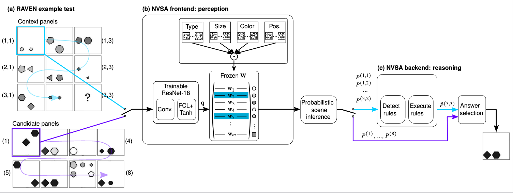

# A Neuro-vector-symbolic Architecture for Solving Raven’s Progressive Matrices

### Michael Hersche, Mustafa Zeqiri, Luca Benini, Abu Sebastian, Abbas Rahimi

_Nature Machine Intelligence'23_

<div align="center">
  
</div>

## [[Paper]](https://arxiv.org/pdf/2203.04571.pdf)

## Requirements

### Hardware
You will need a machine with a CUDA-enabled GPU and the Nvidia SDK installed to compile the CUDA kernels. We tested our methods on an NVIDA Tesla A100 GPU with CUDA Version 11.3.1. Moreover, the dataset requries overall 32 GB of memory. 

### Installing Dependencies

The `conda` software is required for running the code. Generate a new environment with

```
$ conda create --name myNVSAenv python=3.7
$ conda activate myNVSAenv
```

We need PyTorch 1.11 and CUDA. 

```
$ (myNVSAenv) conda install pytorch==1.11.0 torchvision==0.12.0 cudatoolkit=11.3 -c pytorch -c conda-forge
$ (myNVSAenv) pip install -r requirements.txt
```

As a last requirement, you need to install the [neuro-vsa](https://github.ibm.com/her-zurich/neuro-vsa) by cloning the code and running

```
$ (myNVSAenv) pip install -e /path/to/neuro-vsa/ --no-dependencies
```

Make sure to activate the environment before running any code. The installation time was 10 min. 

### Download RAVEN/I-RAVEN Dataset

Download the `.npz` and `.xml` files of the RAVEN dataset [here](http://wellyzhang.github.io/project/raven.html#dataset) as presented in „RAVEN: A Dataset for Relational and Analogical Visual rEasoNing„ by Zhang et al. (2019). Let `DATAPATH/` be the path to the saved data.

## Prepare Data

Run the rule preprocessing script which you can get [here](https://github.com/WellyZhang/PrAE/tree/main/src/auxiliary)
> `$ (myNVSAEnv) python3 preprocess_rule.py`


## Run Model
You can run the end-to-end training  on the RAVEN dataset for all constellation by specifying the 
> `$ (myNVSAEnv)./run.sh `


## License
Please refer to the LICENSE file for the licensing of our code. Our implementation relies on [PrAE](https://github.com/WellyZhang/PrAE) released under GPL v3.0